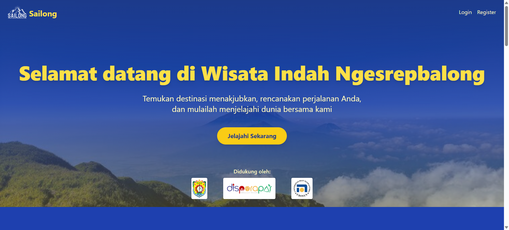

# Sailong - Reservasi Wisata, Kuliner, dan Akomodasi Desa Ngesrepbalong

---

## Tentang Sailong

Sailong adalah portal reservasi dan informasi wisata, kuliner, serta akomodasi di Desa Ngesrepbalong, Kecamatan Limbangan, Kabupaten Kendal, Jawa Tengah. Platform ini memudahkan wisatawan untuk menemukan destinasi menarik, kuliner khas, dan penginapan nyaman dengan tampilan modern, responsif, dan profesional.

## Fitur Utama
- Reservasi wisata, kuliner, dan akomodasi secara online
- Landing page dinamis, modern, dan responsif (tema biru-kuning)
- Admin panel dengan manajemen destinasi, kuliner, akomodasi, user, dan landing page
- Galeri, testimoni, video profil desa, dan highlight fitur
- Navigasi sidebar/topnav dinamis, konsisten, dan mobile friendly
- Validasi, security, dan best practice Laravel

## Teknologi
- Laravel 10.x
- PHP 8.2+
- TailwindCSS 3.x
- SwiperJS (carousel/slider)
- AOS (Animate On Scroll)
- Storage public (untuk gambar)

## Instalasi
1. Clone repo ini
2. Jalankan `composer install`
3. Copy `.env.example` ke `.env` dan sesuaikan konfigurasi database
4. Jalankan `php artisan key:generate`
5. Jalankan migrasi dan seeder: `php artisan migrate --seed`
6. Jalankan server: `php artisan serve`
7. Untuk development assets: `npm install && npm run dev`

## Struktur Utama
- `app/Http/Controllers` - Controller utama (admin & public)
- `app/Models` - Model utama (Accommodation, Destination, Cuisine, User, Booking, Tour, LandingPage)
- `resources/views` - Blade views (admin, public, landing page)
- `routes/web.php` - Route utama (resource & public)

## Preview

## Lisensi
MIT

---

> Sailong dikembangkan untuk mendukung pariwisata dan ekonomi kreatif Desa Ngesrepbalong, Kendal.
